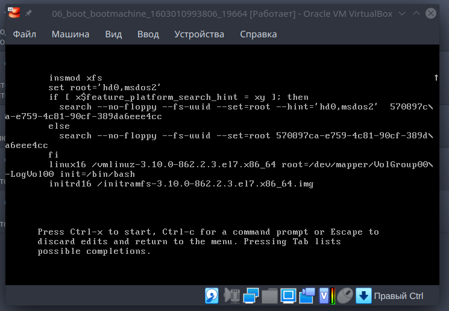
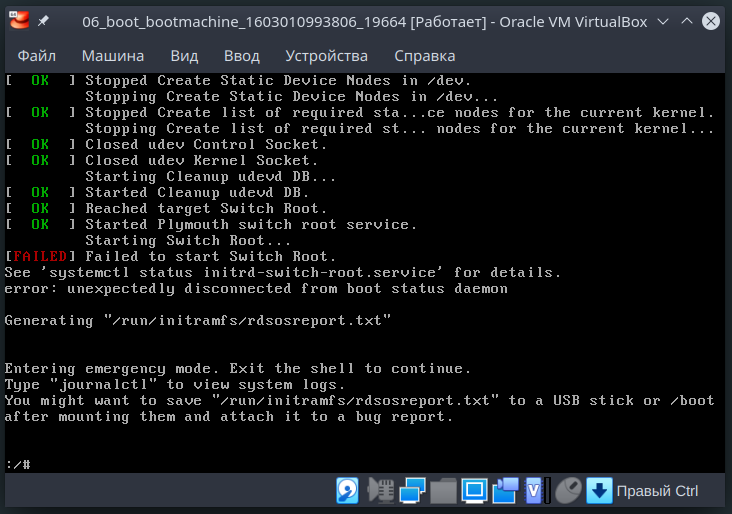

# Задание #6

## Задание

Работа с загрузчиком

1. Попасть в систему без пароля несколькими способами
2. Установить систему с LVM, после чего переименовать VG
3. Добавить модуль в initrd

## 1. Попасть в систему без пароля несколькими способами

### Способ 1

В загрузчике GRUB выбираем редактирование параметров загрузки (клавиша e) и в параметры загрузки ядра (linux/linux16) добавляем параметр `init=/bin/sh`



После этого запускаем загрузку `Ctrl+X`


### Способ 2

Аналогично первому способу добавлем параметр `rd.break`


И загружаемся по `Ctrl+X`


### Способ 3

Аналогично первым двум способам добавляем параметр "rw init=/sysroot/bin/sh"


Выполняем загрузку по `Ctrl+X`



## Установить систему с LVM, после чего переименовать VG

Для переименования Volume Group проделываем следующие шаги:

1. произвести само переименование группы `vgrename VolGroup00 NewGroupName`

2. Что бы сохранить возможность загрузки внести изменнеия в соответствии с новым именем в файлы:
- `/etc/fstab`
- `/etc/default/grub`
- `/boot/grub2/grub.cfg`

3. Пересобираем образ initrd `mkinitrd -f -v /boot/initramfs-$(uname -r).img $(uname -r)`

После перезагрузки система загружается с новым именем Volume Group


## Добавить модуль в initrd

Модули для dracut находятся в каталоге `/usr/lib/dracut/modules.d/` Для добавления своего модуля создадим новый каталог 01mymod

`mkdir /usr/lib/dracut/modules.d/01mymod`

Добавим два файла:

<details>
<summary><code>/usr/lib/dracut/modules.d/01mymod/module-setup.sh</code></summary>

```
#!/bin/bash
check() {
return 0
}

depends() {
return 0
}

install() {
inst_hook cleanup 00 "${moddir}/mymod.sh"
}
```
</details>

<details>
<summary><code>/usr/lib/dracut/modules.d/01mymod/mymod.sh</code></summary>

```
#!/bin/bash
exec 0<>/dev/console 1<>/dev/console 2<>/dev/console
cat << 'EOT'
     ,';,               ,';,
   ,' , :;             ; ,,.;
   | |:; :;           ; ;:|.|
   | |::; ';,,,,,,,,,'  ;:|.|    ,,,;;;;;;;;,,,
   ; |''  ___      ___   ';.;,,''             ''';,,,
   ',:   /   \    /   \    .;.                      '';,
   ;    /    |    |    \     ;,                        ';,
  ;    |    /|    |\    |    :|                          ';,
  |    |    \|    |/    |    :|     ,,,,,,,               ';,
  |     \____| __ |____/     :;  ,''                        ;,
  ;           /  \          :; ,'                           :;
   ',        `----'        :; |'                            :|
     ',,  `----------'  ..;',|'                             :|
    ,'  ',,,,,,,,,,,;;;;''  |'                              :;
  ,'  ,,,,                  |,                              :;
  | ,'   :;, ,,''''''''''   '|.   ...........                ';,
  ;       :;|               ,,';;;''''''                      ';,
   ',,,,,;;;|.............,'                          ....      ;,
             ''''''''''''|        .............;;;;;;;''''',    ':;
                         |;;;;;;;;'''''''''''''             ;    :|
                                                        ,,,'     :;
                                            ,,,,,,,,,,''       .;'
                                           |              .;;;;'
                                           ';;;;;;;;;;;;;;'
EOT
sleep 10
```
</details>

После чего необходимо пересобрать образ initrd

`dracut -f -v`

После чего при загрузке системы будет выводится изображение котика на 10 секунд :-)